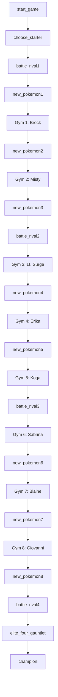

# C-killed-my-charmander

Team Members: Luke "deez nuts" Bishop, Jacob "carry the team" Losey, Max "makima is my queen" Barlow

###  flowchart

| `Pokemon`    |               |    Luke   |
| ------------------ | ------------- | ------------ |
| `argument:type`    | records the stats, names, type of pokemon used in both enemys and players team  |              |
***
| `Battle`    |               |   Luke    |
| ------------------ | ------------- | ------------ |
| `argument:type`    | takes the list of pokemon from gym leaders and player to battle |              |
***
| `Inventory`    |               |   Luke    |
| ------------------ | ------------- | ------------ |
| `argument:type`    | holds all the cunsumables and players pokemon  |              |
***
| `Player`    |               |   Max    |
| ------------------ | ------------- | ------------ |
| `argument:type`    | probably just inventory and player pokemon if made its own thing  |              |
***
| `Enemy`    |               |   Max    |
| ------------------ | ------------- | ------------ |
| `argument:type`    | holds the list of pokemon and there stats for each enemy  |              |
***
| `Rooms/Gym leaders`    |               |   Max    |
| ------------------ | ------------- | ------------ |
| `argument:type`    | calls the enemy and ridlle gor each gym  |              |
***
| `Win loss conditions`    |               |   Max    |
| ------------------ | ------------- | ------------ |
| `argument:type`    | checks if you beat the champion or lost earlyer  |              |
***
| `main`    |               |   Jacob    |
| ------------------ | ------------- | ------------ |
| `argument:type`    | holds all the other things  |              |
***
| `riddle`    |               |   Jacob    |
| ------------------ | ------------- | ------------ |
| `argument:type`    | holds riddles or somthing with the answer  |              |
***
| `pokemon generator`    |               |   Jacob    |
| ------------------ | ------------- | ------------ |
| `argument:type`    | random giv player pokemon fitting the level they are at  |              |
***
| `user input`    |               |   Jacob    |
| ------------------ | ------------- | ------------ |
| `argument:type`    | IDK what to put for this  |              |
***

https://esp.mit.edu/download/1edacb14c3ec4b8bf875b3496b00cfb6/X5002_pokemon-notes.pdf
